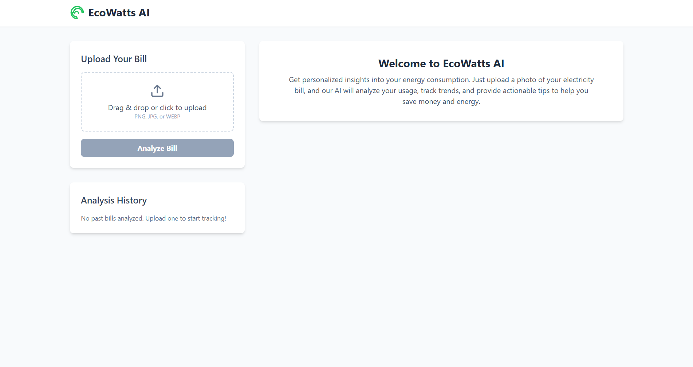
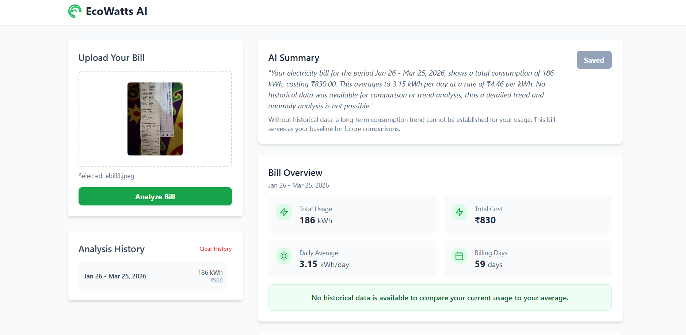
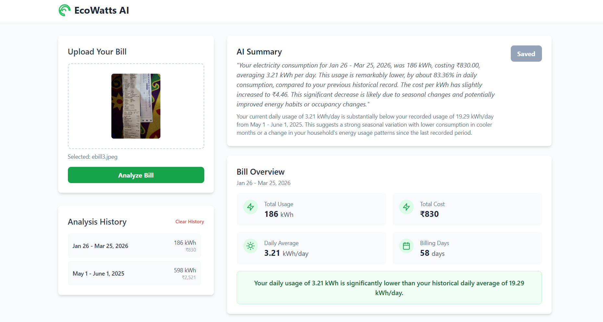
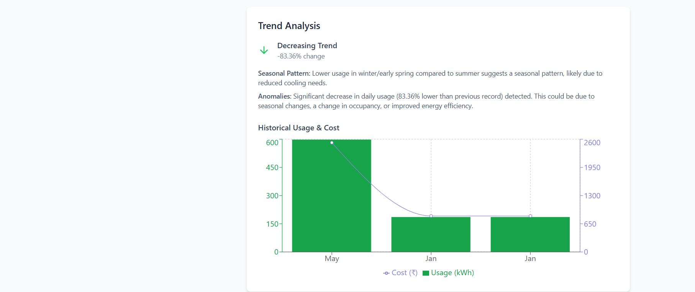
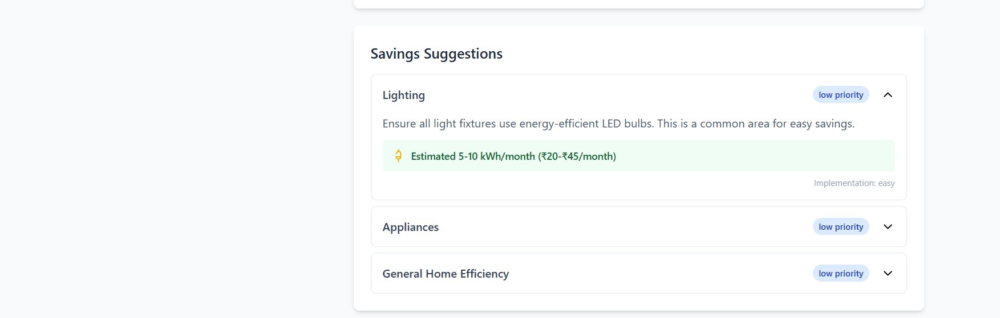

<#  EcoWatts AI

An AI-powered electricity bill analyzer that provides insights into energy consumption, trends, and cost-saving suggestions.

## Features

-  Upload electricity bill image  
-  AI-based analysis  
-  Usage trend visualization  
-  Smart energy-saving suggestions  
-  Historical comparison  

##  Tech Stack

- React + Vite  
- TypeScript  
- Google Gemini API  
- Recharts  

##  Screenshots

##  Setup

1. Install dependencies  
   npm install  

2. Create `.env.local` file  
   VITE_API_KEY=your_api_key_here  

3. Run the app  
   npm run dev  

##  Team Project

This project was developed as part of a team.

